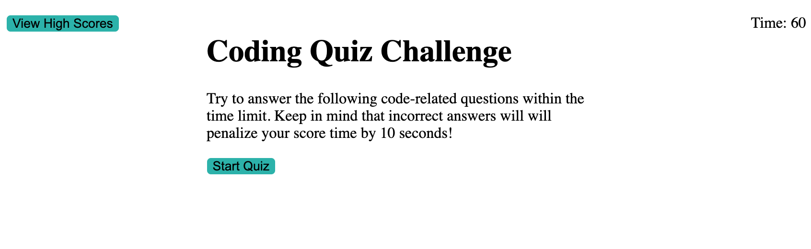

# Coding Quiz

This coding quiz asks a series of questions about javascript in 60 senconds. After each incorrect answer, 10 seconds is subtracted from the clock. When the player finishes all of the questions or the timer runs out, the game ends and the player is prompted to enter their initials for the scoreboard. 

